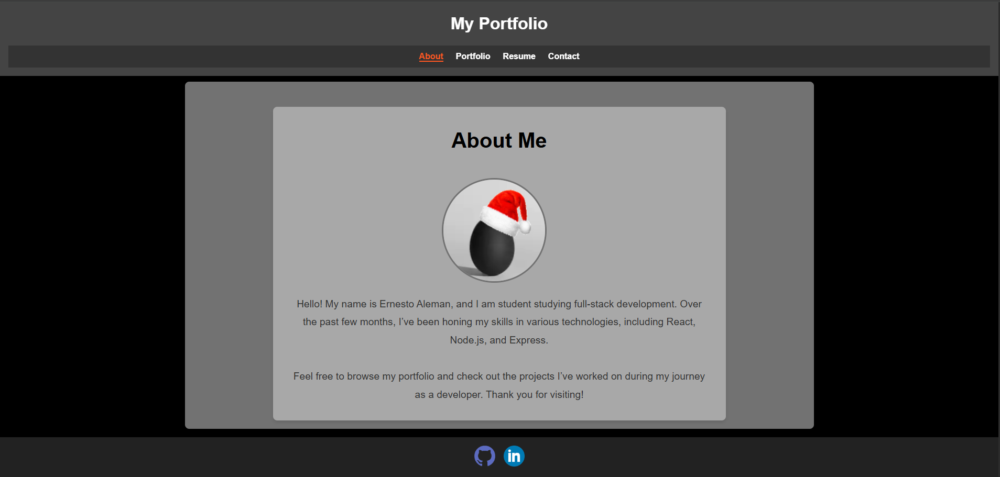

# React-Portfolio


## Table of Contents
- [Description](#description)
- [Installation](#installation)
- [Technologies](#technologies)
- [License](#license)
- [Links](#links)
- [Questions](#questions)

## Description 
This virtual portfolio is deployed to netlify to showcase my various projects, and work that I've worked on since starting the bootcamp course that I joined in November of 2024. It has basic routing to varying pages, minimalistic styling, and the ability to download a resume (it is currently a placeholder).

Screenshot of application: <br>
 <br>

## Installation
If for whatever reason, you would like to launch this locally, issue these commands at root:

```bash
npm i
npm start
```

## Technologies
* JavaScript
* TypeScript
* PostgreSQL
* Node.js
* React

## License
This project is licensed under the MIT License. 

## Links
- [GitHub Repository](https://github.com/Bakenavva/React-Portfolio)
- [Deployed Application](https://react-portfolio-bakenavva.netlify.app/about)

## Questions
Further questions can reach me via:
- GitHub: [Bakenavva](https://github.com/Bakenavva)
- Email:  ernestoaleman00@gmail.com
